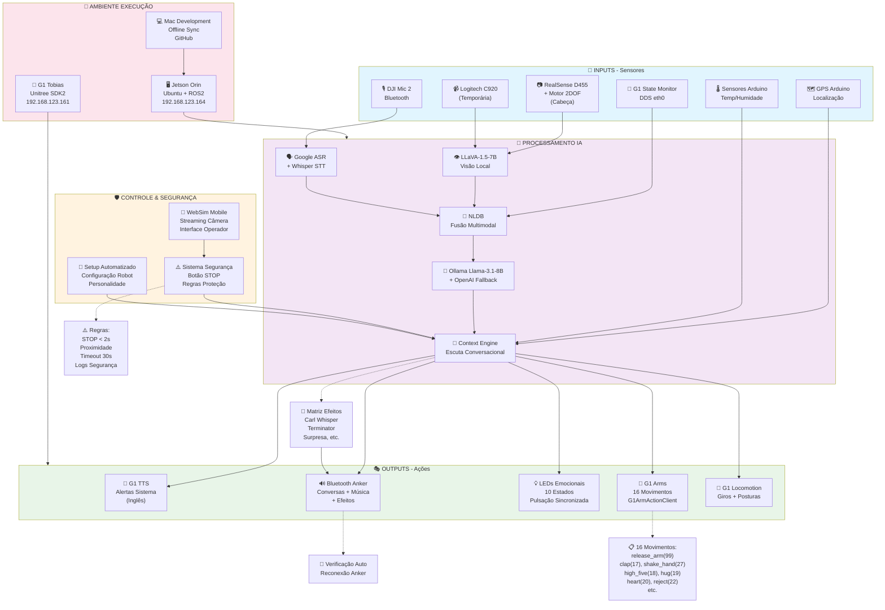

# 🏗️ **DIAGRAMA DE ARQUITETURA - SISTEMA t031a5**

*Sistema de IA Multimodal para Robô Humanóide G1 Tobias*

**🫧 Desenvolvido por Bolha**

---

## **📊 ARQUITETURA VISUAL**

---

## **🔍 EXPLICAÇÃO DOS COMPONENTES**

### **🎤 INPUTS - Camada de Sensores:**
- **RealSense D455** - Câmera principal RGB-D com motor 2DOF para tracking
- **Logitech C920** - Câmera temporária até RealSense chegar
- **DJI Mic 2** - Captura de áudio Bluetooth para conversas
- **GPS Arduino** - Localização precisa para mapeamento
- **Sensores Arduino** - Temperatura, humidade, qualidade ar
- **G1 State Monitor** - Monitoramento contínuo estado robô via DDS

### **🧠 PROCESSAMENTO IA - Pipeline Inteligente:**
- **LLaVA-1.5-7B** - Visão computacional local para análise de imagens
- **Google ASR + Whisper** - Speech-to-Text para processamento de voz
- **NLDB** - Natural Language Data Bus para fusão multimodal
- **Ollama + OpenAI** - LLM local com fallback cloud para decisões
- **Context Engine** - Motor de contexto conversacional contínuo

### **🎭 OUTPUTS - Ações Coordenadas:**
- **G1 TTS** - Apenas alertas sistema em inglês
- **Bluetooth Anker** - Áudio principal para conversas e efeitos
- **LEDs Emocionais** - 10 estados com pulsação sincronizada
- **G1 Arms** - 16 movimentos via G1ArmActionClient
- **G1 Locomotion** - Locomoção com giros usando os pés

### **🛡️ CONTROLE & SEGURANÇA:**
- **WebSim Mobile** - Interface mobile-first com streaming câmera
- **Sistema Segurança** - Botão STOP, regras proteção, monitoramento
- **Setup Automatizado** - Configuração personalidade e parâmetros

### **💾 AMBIENTE EXECUÇÃO:**
- **Jetson Orin** - Processamento principal Ubuntu + ROS2
- **G1 Tobias** - Robô físico com Unitree SDK2
- **Mac Development** - Desenvolvimento offline sincronizado

---

## **🔄 FLUXO DE DADOS**

### **📥 ENTRADA (Input → Processing):**
1. **Sensores** capturam dados multimodais
2. **IA especializada** processa cada modalidade
3. **NLDB** funde todas as informações
4. **LLM** gera resposta contextual

### **📤 SAÍDA (Processing → Output):**
1. **Context Engine** coordena resposta
2. **Ações simultâneas** executadas:
   - Fala via Bluetooth
   - LEDs pulsantes sincronizados
   - Movimentos corporais
   - Efeitos sonoros contextuais

### **🎵 EFEITOS CONTEXTUAIS:**
- **Mulher bonita** → Carl Whisper (10s)
- **Despedidas** → "Hasta la vista baby"
- **Surpresa** → Efeito sonoro
- **Aprovação** → Som complimento
- **E muitos outros...**

---

## **⚡ CARACTERÍSTICAS TÉCNICAS**

### **🔗 Conectividade:**
- **Rede:** eth0 (OBRIGATÓRIO)
- **G1 Tobias:** 192.168.123.161
- **Jetson:** 192.168.123.164
- **WebSim:** Porta 8080 (Mobile-first)

### **⏱️ Performance:**
- **Análise imagem:** 3-5s
- **Resposta completa:** 5-10s
- **Movimento G1:** 2-4s
- **Efeitos audio:** < 0.5s
- **STOP emergência:** < 2s

### **🛡️ Segurança:**
- **Botão STOP** prioritário no WebSim
- **Timeout** máximo 30s para operações
- **Monitoramento** contínuo estado G1
- **Logs** completos de segurança
- **Reconexão** automática Bluetooth

---

## **🎯 DIFERENCIAIS DA ARQUITETURA**

1. **🔄 Processamento Contínuo** - Escuta e analisa ambiente constantemente
2. **🎭 Expressão Coordenada** - Fala + LEDs + movimentos sincronizados  
3. **🎵 Efeitos Contextuais** - Áudios apropriados por situação
4. **📱 Controle Mobile** - Interface operador em tempo real
5. **🛡️ Segurança Integrada** - STOP e proteções em todos os níveis
6. **🔧 Setup Automatizado** - Configuração completa personalidade
7. **💾 Ambiente Híbrido** - Local + Cloud com fallbacks

---

*Diagrama criado em: 20 de Agosto de 2025*  
*Sistema: t031a5 - Robô G1 Tobias*  
*Status: Preparação Fase 1 de Produção*
